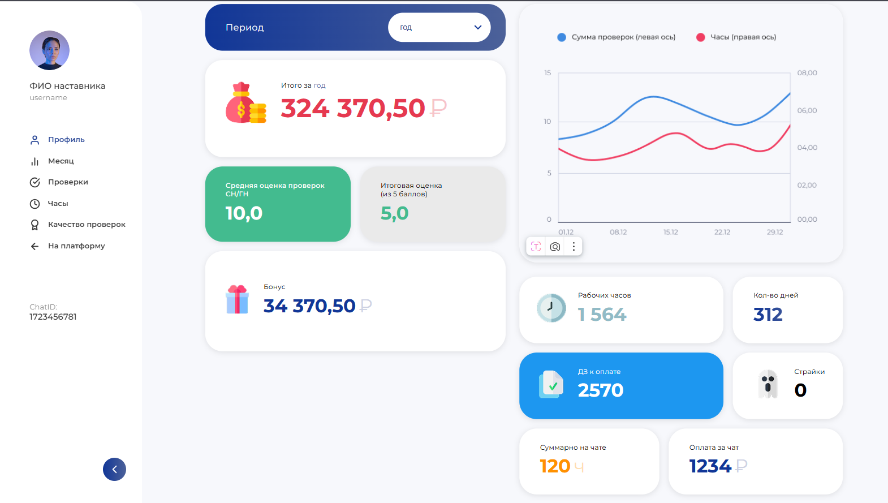
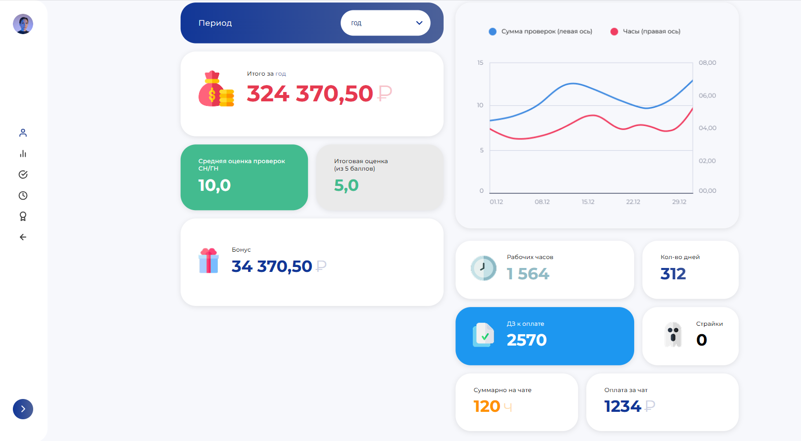
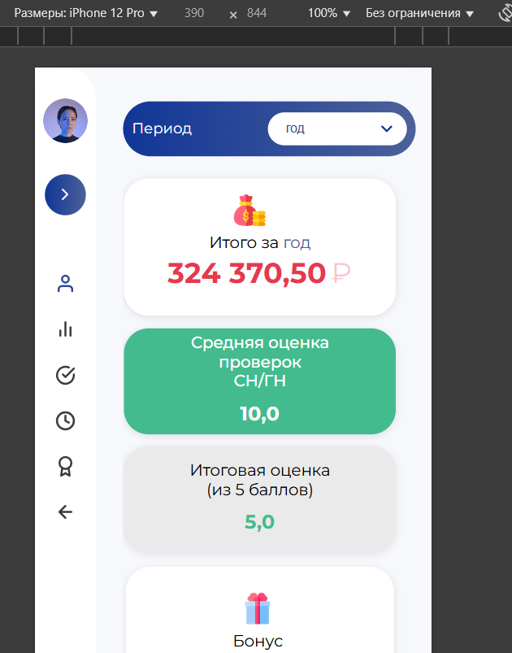
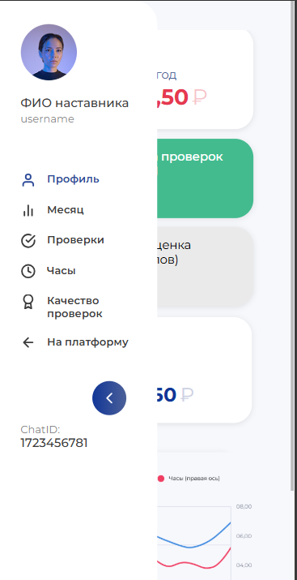

# 🎓 Интерфейс платформы наставников

Разработка одного из экранов внутренней платформы онлайн-школы по Figma-дизайну.  
Проект создавался для улучшения пользовательского опыта наставников.

## 📸 Интерфейс

| Десктопная версия | Свернутый сайдбар |
|-------------------|-------------------|
|  |  |

| Мобильная версия (закрыт сайдбар) | Мобильная версия (открыт сайдбар) |
|-----------------------------------|-----------------------------------|
|  |  |

---

## 🛠️ Технологии

HTML5, CSS3, JavaScript

---

## 💡 Особенности

- Полная адаптивность под разные устройства
- Реализация выпадающих блоков и интерактива
- Использование SVG и PNG-иконок
- Семантическая вёрстка
